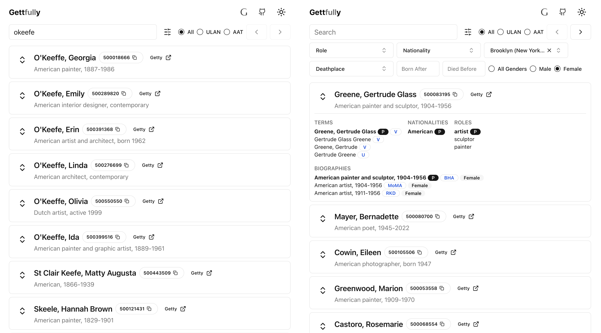

# gettfully

## About

This project provides a simple, fast, powerful, and easy to use search interface for the Getty Vocabularies. 

It’s powered by [Elasticsearch](https://www.elastic.co/) and [Next.js](https://nextjs.org/) with [shadcn-ui](https://github.com/shadcn-ui/ui), [Radix UI](https://www.radix-ui.com/), and [Tailwind CSS](https://tailwindcss.com/).

## Website

[https://getty.musefully.org/](https://getty.musefully.org/)

## Design

### Import

This project uses the Getty Relational Table formats (available in Downloads links below). The relational data exports seem to be more consistently updated than the XML exports.

Relational data files are imported into Elasticsearch using the [Elasticsearch Bulk API](https://www.elastic.co/guide/en/elasticsearch/reference/current/docs-bulk.html).

Each vocabulary is represented by a separate Elasticsearch index, e.g. `ulan-subjects`, `aat-subjects`, etc.

### API

The Next.js API routes are used to provide a simple REST API for the search interface. The API routes are located in the `/app/api` directory.

#### GET /api/search

Primary search endpoint.

Search parameters:
- ***index***: The Elasticsearch vocabulary to search, e.g. `ulan`, `aat`.  If not specified, all vocabularies will be searched.
- ***query***: The search query string.
- ***role***: The role, e.g. `artist`, `architect`, `painter`, etc.
- ***gender***: The gender, e.g. `male`, `female` (ULAN only supports these two).
- ***nationality***: Nationality, e.g. `American`, `French`, etc.
- ***birthPlace***: Birth place, e.g. `Brooklyn (New York City, New York state, United States) (borough)`
- ***deathPlace***: Death place
- ***pageNumber***: Current page number.  1-based.
- ***isMinimal***: If true, only return minimal data for each result. (Useful for GPT endpoints.)

#### GET /api/options

Search for option buckets within an Elasticsearch aggregation.  This is used to provide autocomplete options for the search interface filters.

Search parameters:
- ***field***: The field to return options for, e.g. `roles.name`, `nationalities.name`, `biographies.birthPlaceName`, `biographies.deathPlaceName`.
- ***query***: The search query string.
- ***size***: The maximum number of options to return.

## Getty Vocabularies

The Getty Vocabularies contain structured terminology for art, architecture, decorative arts and other material culture, archival materials, visual surrogates, and bibliographic materials. Compliant with international standards, they provide authoritative information for catalogers, researchers, and data providers.

### The Getty Union List of Artist Names (ULAN)

The Union List of Artist Names ® (ULAN) contains information about people and corporate bodies related to the creation and maintenance of art and architecture. It includes names, rich relationships, notes, sources, and biographical information for artists, architects, firms, studios, repositories, and patrons, both named and anonymous.

[ULAN Online Search](https://www.getty.edu/research/tools/vocabularies/ulan/index.html)
[ULAN REL Data Dictionary](https://www.getty.edu/research/tools/vocabularies/ulan/ulan_rel_dd.pdf)
[ULAN Downloads](http://ulandownloads.getty.edu/)

### The Getty Art & Architecture Thesaurus (AAT)

AAT is a thesaurus containing generic terms in several languages, relationships, sources, and scope notes for agents, work types, roles, materials, styles, cultures, and techniques related to art, architecture, and other cultural heritage (e.g., amphora, oil paint, olieverf, acetolysis, sintering, orthographic drawings, Olmeca, Rinascimento, Buddhism, watercolors, asa-no-ha-toji, sralais).

[AAT Online Search](https://www.getty.edu/research/tools/vocabularies/aat/index.html)
[AAT REL Data Dictionary](https://www.getty.edu/research/tools/vocabularies/aat/aat_rel_dd.pdf)
[AAT Downloads](http://aatdownloads.getty.edu/)

## Development

### Download & Install

Fork/download this project and run `npm i` to install dependencies.

Then, run the development server with `npm run dev` and open [http://localhost:3000](http://localhost:3000) with your browser to see the result.

If you have not yet loaded the Elasticsearch data, you should see an error on the search page that the index does not exist.

#### Local Development Insecure Elasticsearch

Run Elasticsearch in a Docker container:

The `/docker` folder contains a `docker-compose` file for running the Elasticsearch stack locally. (No secruity, only suitable for local development.)

1. `cd docker`
2. `docker compose up`.

Once running, elasticsearch & kibana should be up and running at:

1. Elasticsearch: http://0.0.0.0:9200/
2. Kibana: http://0.0.0.0:5601/app/home#/

### Environment Variables

Once you have a running Elasticsearch service, you can add the connection details to the environment variables.

For local development, add a local `.env.local` file in the root directory. If `ELASTICSEARCH_USE_CLOUD` is "true", the Elastic Cloud vars will be used, otherwise the \_HOST, \_PROTOCOL, \_PORT, \_CA_FILE, and \_API_KEY vars will be used. You may need to copy the http_ca.crt from the Elasticsearch Docker container to a local directory like `./secrets`.

```
ELASTICSEARCH_USE_CLOUD=false
ELASTICSEARCH_CLOUD_ID=elastic-my-museum:dXMtY3VudHJhbDEuZ4NwLmNsb1VkLmVzLmlvOjQ0MyQ5ZEhiNWQ2NDM0NTB0ODgwOGE1MGVkZDViYzhjM2QwMSRjNmE2M2IwMmE3NDQ0YzU1YWU2YTg4YjI2ZTU5MzZmMg==
ELASTICSEARCH_CLOUD_USERNAME=elastic
ELASTICSEARCH_CLOUD_PASSWORD=changeme
ELASTICSEARCH_LOCAL_NODE=http://localhost:9200
ELASTICSEARCH_BULK_LIMIT=2000
```

### Load Vocabulary Data

## Loading the data

Go to the Getty download links above and download the REL relational data files for the vocabularies you want to load. Unzip the files and place them in the `/data/[vocab]/` directory, e.g. `/data/ulan/ulan_rel_0124`.

Two data-loading commands are available:

- `npm run load:ulan` - Load the ULAN vocabulary
- `npm run load:aat` - Load the AAT vocabulary

The import script will load data from the REL files in the data directory into Elasticsearch indices. **_Warning: This will modify Elasticsearch indices._**

## Screenshots

Left: Showing fuzzy search results for misspelled artist name.

Right: Filtered search for female artists born in Brooklyn.



## TODO

This is just a proof of concept. If there is interest, I will add more features, facets, and additional vocabularies.
